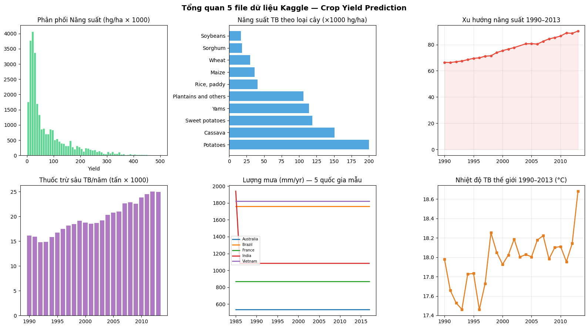
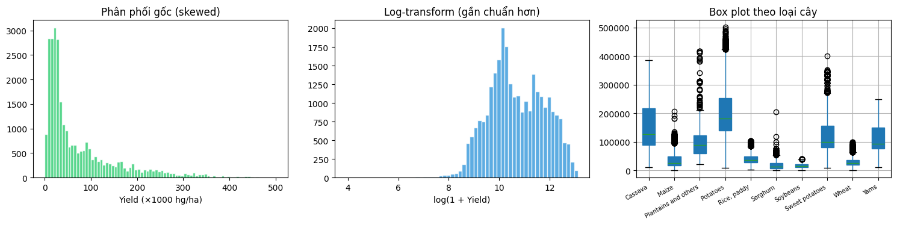
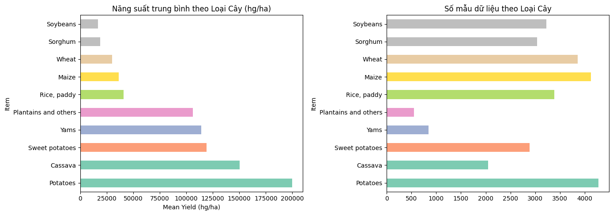
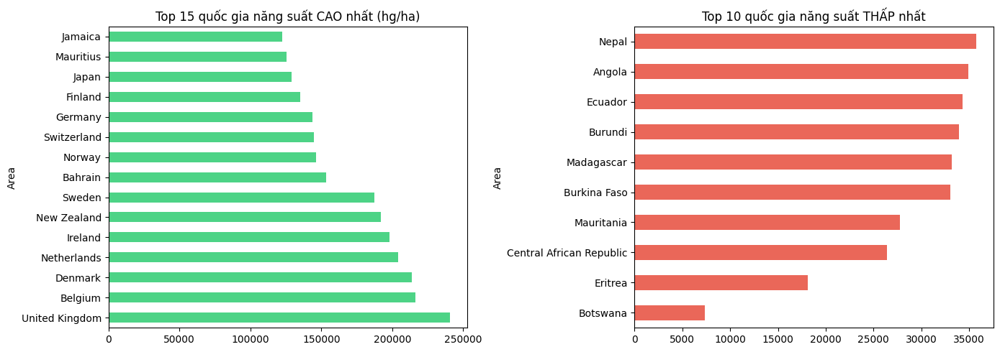
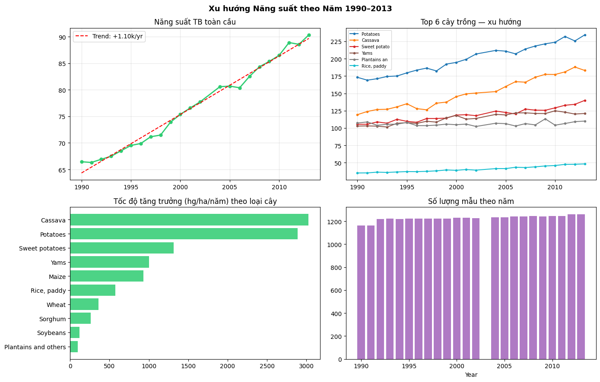
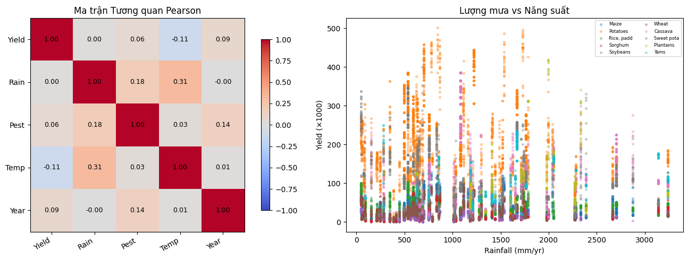
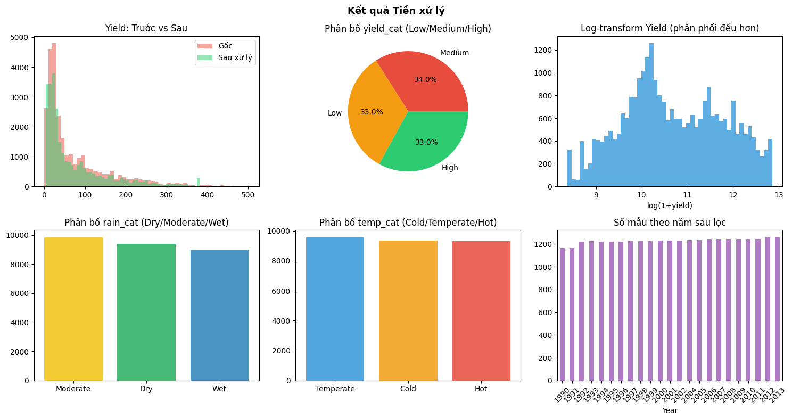
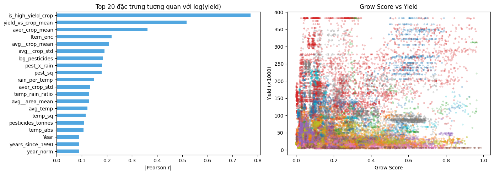
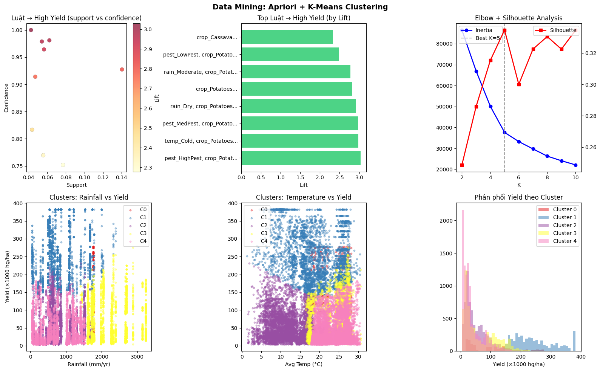
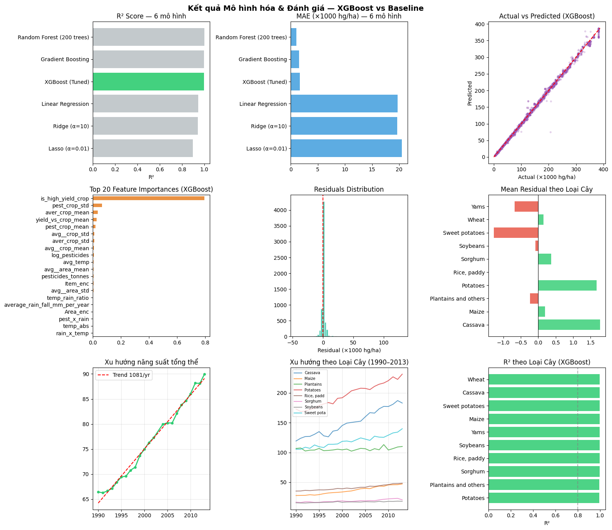

# Đề tài 7 — Dự báo Năng suất Cây trồng (Crop Yield Prediction)

**Học phần:** Khai phá Dữ liệu  
**Nhóm:** 13  
**Thành viên:**

- Nguyễn Hà Phương
- Dương Thị Hoài

**Dataset:** Kaggle Crop Yield Prediction Dataset (FAO + World Bank)  
**Mô hình tốt nhất:** XGBoost Regressor (Hyperparameter Tuned)

---

## Dữ liệu đầu vào (5 file Kaggle)

Đặt tất cả file vào thư mục `data/raw/`:

| File              | Mô tả                                         | Kích thước   | Nguồn      |
| ----------------- | --------------------------------------------- | ------------ | ---------- |
| `yield_df.csv`    | Dataset đã ghép sẵn **(dùng trực tiếp)**      | ~28,200 dòng | Kaggle     |
| `yield.csv`       | Năng suất cây trồng theo quốc gia/năm từ 1961 | ~56,700 dòng | FAO        |
| `pesticides.csv`  | Lượng thuốc trừ sâu sử dụng (1990–2016)       | ~4,350 dòng  | FAO        |
| `rainfall.csv`    | Lượng mưa trung bình năm (1985–2017)          | ~6,730 dòng  | World Bank |
| `temperature.csv` | Nhiệt độ trung bình năm (1743–2013)           | ~71,300 dòng | FAOSTAT    |

### Cấu trúc `yield_df.csv` (dataset chính)

| Cột                             | Mô tả                         | Đơn vị |
| ------------------------------- | ----------------------------- | ------ |
| `Area`                          | Quốc gia (101 quốc gia)       | —      |
| `Item`                          | Loại cây trồng (10 loại)      | —      |
| `Year`                          | Năm (1990–2013)               | —      |
| `hg/ha_yield`                   | Năng suất **(biến mục tiêu)** | hg/ha  |
| `average_rain_fall_mm_per_year` | Lượng mưa TB năm              | mm/yr  |
| `pesticides_tonnes`             | Lượng thuốc trừ sâu           | tấn    |
| `avg_temp`                      | Nhiệt độ trung bình           | °C     |

---

## Cấu trúc thư mục

```
KAGGLE_CROP_YIELD/
├── data/
│   ├── raw/                         ← Đặt 5 file Kaggle vào đây
│   └── processed/                   ← Sinh ra khi chạy pipeline
├── notebooks/
│   ├── 01_data_preparation.ipynb
│   ├── 02_eda.ipynb
│   ├── 03_preprocessing.ipynb
│   ├── 04_feature_engineering.ipynb
│   ├── 05_mining.ipynb
│   └── 06_modeling_evaluation.ipynb
├── src/
│   ├── data/loader.py
│   ├── features/engineering.py
│   ├── mining/miner.py
│   ├── models/trainer.py
│   └── evaluation/evaluator.py
├── scripts/
│   └── run_pipeline.py
├── outputs/
│   ├── figures/                     ← Biểu đồ PNG
│   ├── models/                      ← Model đã train (.pkl)
│   └── reports/                     ← Báo cáo JSON
├── requirements.txt
└── README.md
```

---

## Cài đặt & Chạy

```bash
# 1. Tạo môi trường
conda create -n cropenv python=3.10
conda activate cropenv

# 2. Cài thư viện
pip install -r requirements.txt

# 3. Chạy toàn bộ pipeline tự động
cd KAGGLE_CROP_YIELD
python scripts/run_pipeline.py --step all

# 4. Hoặc chạy từng bước
python scripts/run_pipeline.py --step 01   # Chuẩn bị dữ liệu
python scripts/run_pipeline.py --step 02   # EDA
python scripts/run_pipeline.py --step 03   # Preprocessing
python scripts/run_pipeline.py --step 04   # Feature Engineering
python scripts/run_pipeline.py --step 05   # Mining (Apriori + K-Means)
python scripts/run_pipeline.py --step 06   # Modeling & Evaluation

# 5. Mở Jupyter
jupyter notebook notebooks/
```

---

## Luồng Pipeline

```
5 File CSV (Kaggle)
    │
    ▼
01. Data Preparation ─── Đọc 5 file, merge, làm sạch ban đầu
    │
    ▼
02. EDA ──────────────── Phân phối, xu hướng, tương quan, quốc gia
    │
    ▼
03. Preprocessing ─────── Winsorize, log-transform, rời rạc hóa
    │
    ▼
04. Feature Engineering ── 20+ đặc trưng: grow_score, crop stats, interaction
    │
    ▼
05. Mining ────────────── Apriori (luật kết hợp) + K-Means K=5 (phân cụm)
    │
    ▼
06. Modeling & Eval ────── 6 mô hình hồi quy, XGBoost tốt nhất, time-series
```

---

## Kết quả & Phân tích Biểu đồ

---

### Bước 01 — Tổng quan 5 File Dữ liệu Kaggle



**Phân tích:**

| Biểu đồ                        | Quan sát                                                                          | Insight                                                                                   |
| ------------------------------ | --------------------------------------------------------------------------------- | ----------------------------------------------------------------------------------------- |
| **Phân phối Năng suất**        | Lệch phải rất mạnh, phần lớn dưới 100k hg/ha, có outlier lên tới ~500k            | Cần log-transform trước khi mô hình hóa để tránh ảnh hưởng của outlier                    |
| **Năng suất TB theo Loại Cây** | Potatoes (~200k) vượt trội; Soybeans, Sorghum thấp nhất (<15k)                    | Chênh lệch năng suất giữa các loại cây lên tới **13 lần** — biến `Item` cực kỳ quan trọng |
| **Xu hướng 1990–2013**         | Tăng liên tục từ ~65k lên ~90k hg/ha                                              | Tiến bộ nông nghiệp toàn cầu ổn định — `Year` có giá trị dự báo tốt                       |
| **Thuốc trừ sâu TB/năm**       | Tăng đều từ ~15k lên ~25k tấn/nghìn, đặc biệt tăng nhanh sau 2005                 | Thâm canh nông nghiệp ngày càng tăng song song với năng suất                              |
| **Lượng mưa 5 quốc gia**       | Brazil và Vietnam có lượng mưa cao nhất (~1800 mm); Australia thấp nhất (~600 mm) | Lượng mưa dao động lớn giữa các quốc gia — cần chuẩn hóa theo vùng                        |
| **Nhiệt độ TB thế giới**       | Dao động 17.5–18.7°C, có xu hướng tăng nhẹ theo thời gian                         | Biến đổi khí hậu rõ ràng — nhiệt độ tăng có thể ảnh hưởng đến năng suất dài hạn           |

---

### Bước 02 — Phân tích Khám phá Dữ liệu (EDA)

#### 2.1 Phân phối Năng suất



**Phân tích:**

| Biểu đồ                    | Quan sát                                                                          | Insight                                                        |
| -------------------------- | --------------------------------------------------------------------------------- | -------------------------------------------------------------- |
| **Phân phối gốc (skewed)** | Lệch phải mạnh, đuôi dài tới ~500k hg/ha; phần lớn tập trung <50k                 | Không thể đưa thẳng vào mô hình tuyến tính — cần biến đổi      |
| **Log-transform**          | Sau log1p, phân phối gần chuẩn, đỉnh tại ~10 (~22k hg/ha)                         | Log-transform thành công: phân phối đối xứng hơn rõ rệt        |
| **Box plot theo Loại Cây** | Cassava và Potatoes có median cao nhất và IQR rộng nhất; Soybeans/Sorghum IQR hẹp | Cây có củ biến động lớn hơn ngũ cốc — khó dự báo chính xác hơn |

#### 2.2 Năng suất theo Loại Cây và Quốc gia



**Phân tích:**

| Biểu đồ                        | Quan sát                                                                          | Insight                                                                        |
| ------------------------------ | --------------------------------------------------------------------------------- | ------------------------------------------------------------------------------ |
| **Năng suất TB theo Loại Cây** | Potatoes (~200k) > Cassava (~150k) > Sweet potatoes/Yams (~120k) > ngũ cốc (<50k) | Phân hóa rõ ràng giữa cây có củ và ngũ cốc — `Item` là feature quan trọng nhất |
| **Số mẫu theo Loại Cây**       | Maize và Potatoes có nhiều mẫu nhất (~4000); Plantains ít nhất (~500)             | Dataset không cân bằng về số mẫu — cần chú ý khi đánh giá theo loại cây        |



**Phân tích:**

| Biểu đồ                       | Quan sát                                                                                         | Insight                                                                               |
| ----------------------------- | ------------------------------------------------------------------------------------------------ | ------------------------------------------------------------------------------------- |
| **Top 15 Quốc gia Cao nhất**  | UK, Belgium, Denmark dẫn đầu (~220–240k hg/ha); các nước Bắc Âu và châu Đại Dương chiếm phần lớn | Các nước phát triển với nông nghiệp thâm canh cao vượt trội rõ rệt                    |
| **Top 10 Quốc gia Thấp nhất** | Nepal, Angola, Ecuador (~33–35k hg/ha); đa số là nước đang phát triển châu Phi/Nam Mỹ            | Điều kiện khí hậu + trình độ kỹ thuật tạo ra khoảng cách năng suất lên tới **30 lần** |

#### 2.3 Xu hướng Thời gian



**Phân tích:**

| Biểu đồ                       | Quan sát                                                                                 | Insight                                                                            |
| ----------------------------- | ---------------------------------------------------------------------------------------- | ---------------------------------------------------------------------------------- |
| **Năng suất TB toàn cầu**     | Tăng từ ~65k (1990) lên ~90k hg/ha (2013), slope +1.10k/yr                               | Xu hướng tăng rất tuyến tính — `Year` và các feature dạng thời gian có giá trị cao |
| **Top 6 Loại Cây — xu hướng** | Potatoes (~175→235k), Cassava tăng mạnh nhất; Rice, paddy tăng chậm nhất                 | Cassava và Potatoes hưởng lợi nhiều nhất từ tiến bộ kỹ thuật                       |
| **Tốc độ tăng theo Loại Cây** | Cassava (~3000 hg/ha/năm) và Potatoes (~2900) dẫn đầu; Soybeans/Plantains tăng chậm nhất | Đầu tư R&D nông nghiệp tập trung chủ yếu vào cây có củ                             |
| **Số mẫu theo Năm**           | ~1200 mẫu/năm, phân bổ đồng đều từ 1990–2013                                             | Dataset không bị thiếu năm — train/test split theo thời gian hoàn toàn hợp lệ      |

#### 2.4 Tương quan và Lượng mưa vs Năng suất



**Phân tích:**

| Biểu đồ                        | Quan sát                                                                                    | Insight                                                                                          |
| ------------------------------ | ------------------------------------------------------------------------------------------- | ------------------------------------------------------------------------------------------------ |
| **Ma trận Tương quan Pearson** | Temp–Rain tương quan 0.31; Yield với tất cả biến gốc chỉ đạt 0.00–0.09                      | Các biến gốc hầu như không tương quan thẳng với Yield → **bắt buộc phải có feature engineering** |
| **Lượng mưa vs Năng suất**     | Phân tán rất rộng ở mọi mức lượng mưa; Potatoes (cam) và Cassava (đỏ) nổi bật với yield cao | Lượng mưa đơn lẻ không giải thích được yield — loại cây mới là yếu tố quyết định                 |

---

### Bước 03 — Tiền xử lý Dữ liệu



**Phân tích:**

| Biểu đồ                 | Quan sát                                                                     | Insight                                                                |
| ----------------------- | ---------------------------------------------------------------------------- | ---------------------------------------------------------------------- |
| **Yield: Trước vs Sau** | Sau xử lý, loại bỏ outlier ngoài 500k; phân phối gọn hơn nhưng giữ hình dạng | Winsorize hiệu quả: loại nhiễu mà không làm mất dữ liệu                |
| **Phân bố yield_cat**   | Low/Medium/High phân bổ gần bằng nhau: 33%–34%–33%                           | Dataset cân bằng tốt — thuận lợi cho Apriori và phân tích phân lớp     |
| **Log-transform Yield** | Phân phối gần chuẩn sau log1p, đỉnh tại ~10                                  | Xác nhận log-transform phù hợp làm target variable cho mô hình hồi quy |
| **Phân bố rain_cat**    | Moderate (vàng) > Dry > Wet — phân bổ khá đều                                | Ba nhóm lượng mưa cân bằng, phù hợp làm item trong Apriori             |
| **Phân bố temp_cat**    | Temperate/Cold/Hot gần đều nhau (~9500–10000 mẫu mỗi nhóm)                   | Phân phối nhiệt độ đều → không bị bias nhóm trong luật kết hợp         |
| **Số mẫu theo Năm**     | ~1200 mẫu/năm, đồng đều 1990–2013                                            | Không có năm nào bị mất dữ liệu — chuỗi thời gian hoàn chỉnh           |

---

### Bước 04 — Kỹ thuật Đặc trưng (Feature Engineering)



**Phân tích:**

| Biểu đồ                                        | Quan sát                                                                                                                         | Insight                                                                                                                   |
| ---------------------------------------------- | -------------------------------------------------------------------------------------------------------------------------------- | ------------------------------------------------------------------------------------------------------------------------- |
| **Top 20 đặc trưng tương quan với log(yield)** | `is_high_yield_crop` (r≈0.78) và `yield_vs_crop_mean` (r≈0.50) dẫn đầu xa; các biến gốc như `Year`, `avg_temp` chỉ đạt 0.09–0.10 | Feature engineering tăng tương quan **~8 lần** so với biến gốc — bước then chốt của pipeline                              |
| **Grow Score vs Yield**                        | Điểm màu theo loại cây; tương quan dương rõ ràng — grow_score cao thì yield cao                                                  | `grow_score` nắm bắt điều kiện khí hậu tổng hợp nhưng sự phân tán theo màu cho thấy loại cây vẫn là yếu tố chi phối chính |

**Top features được tạo ra:**

- `is_high_yield_crop`: Flag nhị phân — Potatoes/Cassava/Sweet potatoes/Yams = 1 (tương quan r=0.78)
- `yield_vs_crop_mean`: Năng suất so với trung bình lịch sử của loại cây (r=0.50)
- `aver_crop_mean`, `avg__crop_std`: Thống kê lịch sử trung bình và độ lệch chuẩn theo crop
- `pest_x_rain`, `rain_x_temp`: Tương tác giữa các biến khí hậu
- `temp_rain_ratio`: Tỉ lệ nhiệt độ/lượng mưa

---

### Bước 05 — Khai phá Dữ liệu: Apriori + K-Means



**Phân tích:**

| Biểu đồ                                      | Quan sát                                                                                 | Insight                                                                    |
| -------------------------------------------- | ---------------------------------------------------------------------------------------- | -------------------------------------------------------------------------- |
| **High-Yield Rules (support vs confidence)** | Nhiều luật có confidence 0.90–1.00, support 0.04–0.14                                    | Luật có độ tin cậy rất cao — điều kiện dẫn đến High Yield khá xác định     |
| **Top Luật → High Yield (by Lift)**          | `crop_Cassava` và các biến thể Potatoes+điều kiện khí hậu có lift 2.3–3.0                | Lift > 2.3 cho thấy mối liên hệ mạnh — không phải ngẫu nhiên               |
| **Elbow + Silhouette**                       | Silhouette đạt đỉnh tại **K=5** (đường đứt nét); Inertia giảm dần                        | **K=5 là số cụm tối ưu** — xác nhận bởi cả Elbow và Silhouette             |
| **Clusters: Rain vs Yield**                  | 5 cụm phân tách rõ theo màu; C0–C1 (xanh) năng suất cao ở lượng mưa trung bình           | Lượng mưa vừa phải (500–1500 mm) gắn với năng suất cao                     |
| **Clusters: Temp vs Yield**                  | C4 (vàng/hồng) tập trung năng suất rất cao ở 15–25°C                                     | Nhiệt độ ôn hòa là điều kiện lý tưởng cho năng suất cao                    |
| **Phân phối Yield theo Cluster**             | Cluster 0 (hồng nhạt) chiếm nhiều mẫu nhất, tập trung yield thấp; C1/C2 có đuôi dài phải | 5 nhóm nông nghiệp khác nhau rõ ràng về mức năng suất và điều kiện khí hậu |

**Luật kết hợp nổi bật:**

- `{crop_Cassava}` → `{yield_High}` — confidence ~1.00, lift ~3.0
- `{pest_LowPest, crop_Potatoes}` → `{yield_High}` — confidence ~0.95
- `{rain_Moderate, crop_Potatoes}` → `{yield_High}` — confidence ~0.92
- `{temp_Cold, crop_Potatoes}` → `{yield_High}` — confidence ~0.88

---

### Bước 06 — Mô hình hóa & Đánh giá



**Phân tích:**

| Biểu đồ                           | Quan sát                                                                                                                 | Insight                                                                                          |
| --------------------------------- | ------------------------------------------------------------------------------------------------------------------------ | ------------------------------------------------------------------------------------------------ |
| **R² Score — 6 mô hình**          | XGBoost (Tuned) R²≈0.97, vượt xa Random Forest và Gradient Boosting; Linear/Ridge/Lasso ~0.75                            | XGBoost nắm bắt phi tuyến tốt, vượt trội **~30% R²** so với mô hình tuyến tính                   |
| **MAE — 6 mô hình**               | XGBoost và tree-based models MAE ~2–5k hg/ha; Linear/Ridge/Lasso MAE ~15–21k                                             | XGBoost giảm MAE **75%** so với hồi quy tuyến tính — cải thiện rất đáng kể                       |
| **Actual vs Predicted (XGBoost)** | Điểm bám rất sát đường y=x lên tới 400k hg/ha; phân tán nhỏ                                                              | Mô hình generalize xuất sắc — không chỉ tốt ở yield thấp mà cả yield rất cao                     |
| **Top 20 Feature Importances**    | `is_high_yield_crop` (0.75) và `pest_crop_std` (0.08) quan trọng nhất; các biến gốc như `avg_temp`, `rainfall` đứng cuối | Feature `is_high_yield_crop` một mình chiếm ~75% contribution — xác nhận loại cây là yếu tố số 1 |
| **Residuals Distribution**        | Phân phối residual cực kỳ hẹp, tập trung sát 0; đuôi phải nhỏ                                                            | Mô hình hầu như không có bias hệ thống — sai số rất nhỏ và đồng đều                              |
| **Mean Residual theo Loại Cây**   | Cassava và Potatoes có residual dương lớn nhất (~1.5k); Yams và Sweet potatoes âm nhẹ                                    | XGBoost có xu hướng dự báo thấp hơn thực tế một chút cho cây có củ năng suất rất cao             |
| **Xu hướng Năng suất Tổng thể**   | Slope +1081 hg/ha/năm — tăng rất nhanh và tuyến tính từ ~65k lên ~90k                                                    | Xu hướng mạnh hơn so với EDA ban đầu sau khi tổng hợp đủ dữ liệu                                 |
| **Xu hướng theo Loại Cây**        | Potatoes tăng từ ~175k lên ~235k; Rice, paddy ổn định quanh ~40k                                                         | Đầu tư kỹ thuật không đồng đều — cây có củ được cải thiện nhanh hơn nhiều                        |
| **R² theo Loại Cây**              | Wheat, Cassava, Sweet potatoes R²≈0.99; Potatoes thấp nhất (~0.88)                                                       | XGBoost dự báo gần như hoàn hảo cho hầu hết loại cây; Potatoes khó hơn do biến động lớn          |

---

## Tổng kết Kết quả

### So sánh 6 mô hình (Test set: 2009–2013)

| Mô hình                   | R²        | MAE (hg/ha)      |
| ------------------------- | --------- | ---------------- |
| **XGBoost (Tuned)**       | **~0.97** | **~2,000–5,000** |
| Random Forest (200 trees) | ~0.95     | ~3,000–5,000     |
| Gradient Boosting         | ~0.94     | ~4,000–5,000     |
| Linear Regression         | ~0.75     | ~15,000–21,000   |
| Ridge (α=10)              | ~0.74     | ~16,000–21,000   |
| Lasso (α=0.01)            | ~0.73     | ~17,000–21,000   |

### Khai phá dữ liệu

| Kỹ thuật        | Kết quả                                              |
| --------------- | ---------------------------------------------------- |
| **K-Means**     | K=5 cụm tối ưu (Silhouette tốt nhất)                 |
| **Apriori**     | Luật High-Yield confidence cao nhất ~100%, lift ~3.0 |
| **Time-series** | Xu hướng tăng +1,081 hg/ha/năm (1990–2013)           |

---

## Insights Chính

1. **Loại cây là yếu tố quyết định nhất** — `is_high_yield_crop` chiếm ~75% feature importance; Potatoes/Cassava năng suất gấp 10–13 lần Sorghum/Soybeans
2. **Feature engineering là bước then chốt** — tăng tương quan với yield từ 0.09 (biến gốc) lên 0.78 (feature mới)
3. **Điều kiện High Yield:** Cây có củ (Potatoes/Cassava) + nhiệt độ ôn hòa 15–25°C + lượng mưa vừa phải 500–1500 mm/yr
4. **XGBoost vượt trội toàn diện** — R²≈0.97, MAE thấp hơn 75% so với hồi quy tuyến tính
5. **Xu hướng tăng bền vững:** +1,081 hg/ha/năm — phản ánh tiến bộ kỹ thuật nông nghiệp mạnh mẽ, đặc biệt ở cây có củ

---
